# Prashanth Kumar

**Software Engineer** · **MS CS @ NYU**

---

### Tech Stack

---

 <table>
   <tr>
     <td rowspan=2>  </td>
     <td>
	     
     </td>
   </tr>
   <tr>
	   <td></td>
   </tr>
   <tr>
	   <td rowspan="2"></td>
   </tr>
   <tr>
	   <td></td>
   </tr>
 </table>

